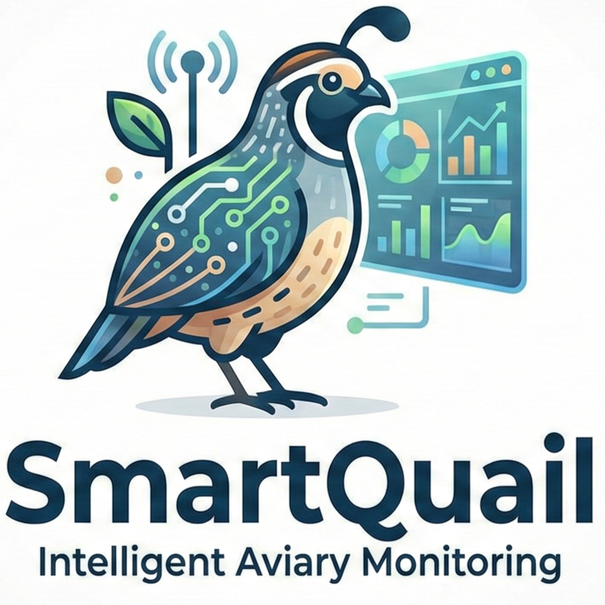

<div align="center">
  

  # 🐦 SmartQuail

  **Sistem Monitoring & Kontrol Kandang Burung Puyuh Berbasis IoT**

  [](https://flutter.dev)
  [](https://firebase.google.com)
  [](https://www.espressif.com)
  [](https://dart.dev)
  [](LICENSE)

  *Pantau suhu, kelembaban, dan kualitas udara kandang puyuhmu secara real-time dari mana saja.*

</div>

---

## 📱 Tentang SmartQuail

SmartQuail adalah aplikasi mobile berbasis Flutter yang terhubung langsung dengan perangkat ESP32 melalui Firebase Realtime Database. Aplikasi ini dirancang khusus untuk peternak burung puyuh agar dapat memantau dan mengontrol kondisi kandang secara remote — mulai dari suhu, kelembaban, kadar amonia (NH₃), hingga kendali perangkat seperti kipas, lampu, dan pompa air.

### Mengapa SmartQuail?

Burung puyuh sangat sensitif terhadap perubahan suhu dan kelembaban. THI (Temperature Humidity Index) di atas 78 dapat menyebabkan *heat stress* yang berujung pada penurunan produksi telur hingga kematian. SmartQuail hadir sebagai solusi monitoring cerdas yang memberikan **notifikasi real-time** dan **kontrol otomatis** untuk menjaga kondisi kandang tetap optimal.

---

## ✨ Fitur Utama

### 📊 Dashboard
- Monitoring real-time suhu, kelembaban, THI Index, dan kadar NH₃
- Status koneksi ESP32 (Online/Offline)
- Indikator zona bahaya berwarna (Normal / Warning / Danger)
- Jam real-time kandang

### 📈 Riwayat Data
- Grafik interaktif suhu, kelembaban, dan THI Index
- Filter periode: 1 Jam, 24 Jam, 7 Hari, 30 Hari
- Zone annotation visual Normal/Warning/Danger pada grafik THI
- Statistik ringkasan (rata-rata, min, max, cooling events)
- Tooltip interaktif saat menyentuh grafik

### 🎛️ Kontrol Perangkat
- Toggle Manual / Auto Mode
- Kontrol kipas dengan PWM stepping: 100% → 50% → Mati
- Kontrol lampu kandang
- Kontrol pompa air
- Status real-time setiap perangkat

### ⚙️ Pengaturan
- Konfigurasi threshold suhu, kelembaban, dan THI
- Pengaturan profil kandang
- Manajemen akun

### ℹ️ Bantuan & Informasi
- Panduan koneksi ESP32
- Penjelasan indikator sensor
- Kebijakan Privasi

---

## 🏗️ Arsitektur Sistem

```
┌─────────────────┐         ┌──────────────────┐         ┌─────────────────┐
│   ESP32 Device  │ ──WiFi──▶  Firebase RTDB   │◀──────── │  SmartQuail App │
│                 │         │                  │          │  (Flutter)      │
│  • DHT22        │         │  /sensors        │          │                 │
│  • MQ-135 (NH₃) │         │  /controls       │          │  • Dashboard    │
│  • MOSFET PWM   │         │  /history        │          │  • History      │
│  • Relay Module │         │  /settings       │          │  • Control      │
└─────────────────┘         └──────────────────┘          └─────────────────┘
```

---

## 🗂️ Struktur Project

```
SmartQuail/
├── lib/
│   ├── main.dart                    # Entry point, routing, auth check
│   ├── firebase_options.dart        # Konfigurasi Firebase
│   ├── screens/
│   │   ├── splash_screen.dart       # Splash screen animasi
│   │   ├── login_screen.dart        # Autentikasi pengguna
│   │   ├── otp_screen.dart          # Verifikasi OTP
│   │   ├── dashboard_screen.dart    # Monitoring real-time
│   │   ├── history_screen.dart      # Grafik riwayat data
│   │   ├── control_screen.dart      # Kontrol perangkat IoT
│   │   ├── settings_screen.dart     # Pengaturan aplikasi
│   │   └── info_screen.dart         # Bantuan & kebijakan privasi
│   ├── services/
│   │   └── history_service.dart     # Logika pengambilan data Firebase
│   └── widgets/                     # Reusable widget components
├── assets/
│   └── images/                      # Logo dan gambar
├── android/                         # Konfigurasi Android
├── ios/                             # Konfigurasi iOS
└── pubspec.yaml                     # Dependencies
```

---

## 🛠️ Tech Stack

| Layer | Teknologi |
|-------|-----------|
| **Mobile App** | Flutter 3.x + Dart 3.x |
| **Database** | Firebase Realtime Database |
| **Autentikasi** | Firebase Authentication |
| **Charts** | fl_chart |
| **IoT Hardware** | ESP32 + DHT22 + MQ-135 |
| **Komunikasi** | WiFi → Firebase RTDB |
| **Platform** | Android, iOS, Web, Windows |

---

## 🚀 Cara Menjalankan

### Prerequisites

- Flutter SDK ≥ 3.0.0
- Dart SDK ≥ 3.0.0
- Android Studio / VS Code
- Akun Firebase

### Instalasi

1. **Clone repository**
   ```bash
   git clone https://github.com/masanuddin/SmartQuail.git
   cd SmartQuail/SmartQuail
   ```

2. **Install dependencies**
   ```bash
   flutter pub get
   ```

3. **Konfigurasi Firebase**
   - Buat project baru di [Firebase Console](https://console.firebase.google.com)
   - Aktifkan **Realtime Database** dan **Authentication**
   - Download `google-services.json` (Android) dan letakkan di `android/app/`
   - Download `GoogleService-Info.plist` (iOS) dan letakkan di `ios/Runner/`
   - Update `lib/firebase_options.dart` dengan konfigurasi projectmu

4. **Struktur Firebase RTDB**
   ```json
   {
     "sensors": {
       "temperature": 28.5,
       "humidity": 70.2,
       "thi": 74.1,
       "ammonia": 12.3,
       "timestamp": 1716178800000
     },
     "controls": {
       "fan_pwm": 100,
       "lamp": false,
       "pump": false,
       "auto_mode": true
     },
     "history": {
       "2026-05-20": { ... }
     }
   }
   ```

5. **Jalankan aplikasi**
   ```bash
   flutter run
   ```

---

## 📡 Setup ESP32

Pastikan firmware ESP32 menggunakan library berikut:
- `FirebaseESP32` atau `Firebase Arduino Client Library`
- `DHT sensor library` untuk DHT22
- `MQ135` untuk sensor amonia

ESP32 harus terhubung ke WiFi yang sama dan menulis data sensor ke path `/sensors` di Firebase RTDB setiap interval waktu yang ditentukan.

---

## 📊 THI Index — Panduan Zona

| Nilai THI | Status | Kondisi |
|-----------|--------|---------|
| < 72 | 🟢 **Normal** | Kondisi optimal untuk puyuh |
| 72 – 78 | 🟡 **Warning** | Perlu perhatian, aktifkan kipas |
| > 78 | 🔴 **Danger** | Bahaya *heat stress*, tindakan segera |

> **Rumus THI:** `THI = T - 0.55 × (1 - RH/100) × (T - 14.5)`
> dimana T = suhu (°C) dan RH = kelembaban relatif (%)

---

## 👥 Tim Pengembang

| Nama | Role |
|------|------|
| Ricky Rudiansyah | Mobile Developer (Flutter) |
| Marcellino Asanuddin | IoT & Hardware Engineer |

---

## 📄 Lisensi

Project ini menggunakan lisensi [MIT](LICENSE).

---

<div align="center">
  <sub>Dibuat dengan ❤️ untuk para peternak puyuh Indonesia 🐦</sub>
</div>
