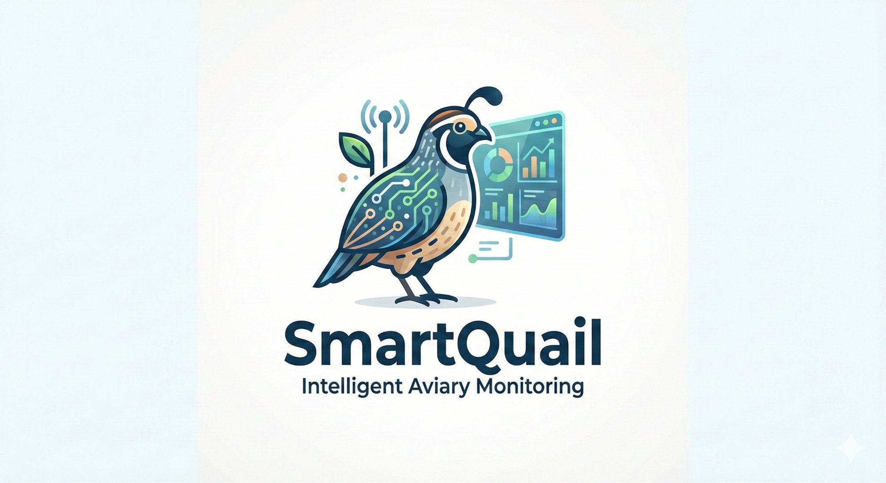

# 🐦 SmartQuail Dashboard

**Intelligent Aviary Monitoring System**

Real-time IoT dashboard untuk monitoring kandang puyuh dengan ESP32, MQTT, dan Supabase.



---

## ✨ Features

- 🌡️ **Real-time Monitoring** - Suhu, kelembaban, dan THI (Temperature Humidity Index)
- 📊 **Interactive Charts** - Visualisasi data dengan Plotly
- 🎯 **THI Gauge** - Indikator visual status thermal comfort
- 💨 **Relay Status** - Monitor status sistem pendingin
- 🌐 **Bilingual** - Support Bahasa Indonesia & English
- 📱 **Responsive** - Tampilan optimal di desktop & mobile
- 💾 **Data Export** - Download data sebagai CSV
- ☁️ **Cloud Ready** - Deploy ke Streamlit Cloud

---

## 🏗️ Architecture

```
┌─────────────┐      ┌─────────────┐      ┌─────────────┐
│   ESP32     │──────│    MQTT     │──────│   Bridge    │
│   + DHT22   │ WiFi │   Broker    │      │   Script    │
└─────────────┘      └─────────────┘      └──────┬──────┘
                                                  │
                                                  ▼
                                          ┌─────────────┐
                                          │  Supabase   │
                                          │  Database   │
                                          └──────┬──────┘
                                                  │
                                                  ▼
                                          ┌─────────────┐
                                          │  Streamlit  │
                                          │  Dashboard  │
                                          └─────────────┘
```

---

## 🚀 Quick Start

### 1. Clone Repository

```bash
git clone https://github.com/yourusername/smartquail-dashboard.git
cd smartquail-dashboard
```

### 2. Install Dependencies

```bash
pip install -r requirements.txt
```

### 3. Setup Environment Variables

Buat file `.env` atau set di Streamlit Cloud:

```env
SUPABASE_URL=https://your-project.supabase.co
SUPABASE_KEY=your-anon-key
```

### 4. Setup Supabase Table

Jalankan SQL ini di Supabase SQL Editor:

```sql
CREATE TABLE sensor_logs (
    id BIGSERIAL PRIMARY KEY,
    device VARCHAR(50) NOT NULL,
    temp DECIMAL(5,2) NOT NULL,
    rh DECIMAL(5,2) NOT NULL,
    thi DECIMAL(5,2) NOT NULL,
    relay VARCHAR(10) NOT NULL,
    status VARCHAR(20) NOT NULL,
    created_at TIMESTAMPTZ DEFAULT NOW()
);

CREATE INDEX idx_sensor_logs_device ON sensor_logs(device);
CREATE INDEX idx_sensor_logs_created_at ON sensor_logs(created_at DESC);

ALTER TABLE sensor_logs ENABLE ROW LEVEL SECURITY;

CREATE POLICY "Allow all operations" ON sensor_logs
    FOR ALL USING (true) WITH CHECK (true);
```

### 5. Run MQTT Bridge (di server/PC)

```bash
python mqtt_bridge.py
```

### 6. Run Dashboard (lokal)

```bash
streamlit run app.py
```

---

## ☁️ Deploy ke Streamlit Cloud

### 1. Push ke GitHub

```bash
git add .
git commit -m "Initial commit"
git push origin main
```

### 2. Deploy di Streamlit Cloud

1. Buka [share.streamlit.io](https://share.streamlit.io)
2. Klik "New app"
3. Connect ke GitHub repository
4. Set main file: `app.py`
5. Tambah secrets di Settings > Secrets:

```toml
SUPABASE_URL = "https://your-project.supabase.co"
SUPABASE_KEY = "your-anon-key"
```

6. Deploy!

---

## 📁 Project Structure

```
smartquail-dashboard/
├── app.py                 # Main Streamlit dashboard
├── config.py              # Configuration & translations
├── database.py            # Supabase database handler
├── mqtt_bridge.py         # MQTT to Supabase bridge
├── requirements.txt       # Python dependencies
├── README.md              # Documentation
├── assets/
│   └── smartquail.png     # Logo
├── styles/
│   └── apple_style.css    # Apple-inspired CSS
└── .streamlit/
    └── config.toml        # Streamlit configuration
```

---

## 🔧 ESP32 Configuration

Pastikan ESP32 kamu mengirim data dalam format JSON:

```json
{
    "device": "esp32-01",
    "temp": 28.3,
    "rh": 72,
    "thi": 78.9,
    "relay": "ON",
    "status": "OK"
}
```

MQTT Settings:
- Broker: `broker.hivemq.com`
- Port: `1883`
- Topic: `iot/smartquail/dht`

---

## 📊 THI (Temperature Humidity Index)

| THI Range | Status | Color |
|-----------|--------|-------|
| < 72 | Normal | 🟢 Green |
| 72 - 78 | Warning | 🟡 Yellow |
| > 78 | Danger | 🔴 Red |

Formula:
```
THI = 0.8 × T + (RH/100) × (T - 14.4) + 46.4
```

---

## 👥 Team

- **Ricky Rudiansyah** (2702243016)
- **Marcellino Asanuddin** (2702242650)

**Supervisor:** Prof. Dr. Ir. Widodo Budiharto, S.Si., M.Kom., IPM.

---

## 📄 License

MIT License - BINUS University © 2025

---

## 🙏 Acknowledgments

- BINUS University
- Prof. Widodo Budiharto
- Streamlit Community
- Supabase Team
